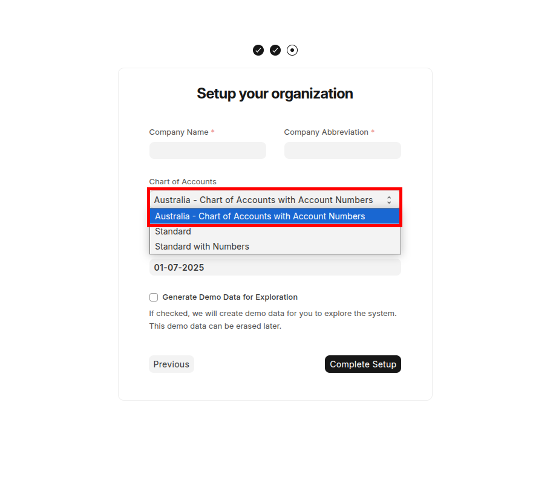
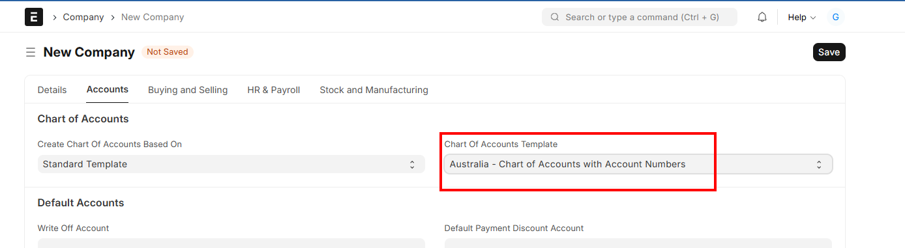

## ERPNext Australian Localisation :

This app will install the Australian localisation functionalities in ERPNext. This app works in line with the Australian Chart of Accounts. This app will assist the Australian companies to get the GST postings based on the Supplier and Customer type (Local / International / Capital Goods / Non Capital Goods). This app will generate the BAS report with the amounts to be reported in each of the BAS Label. 

### Prerequisites

ERPNext v15.74.0 or above

### Installation

The AU Localisation app for ERPNext can be installed using the [bench](https://github.com/frappe/bench) CLI:

```bash
cd $PATH_TO_YOUR_BENCH
bench get-app https://github.com/Arus-Info/ERPNext-Australian-Localisation.git
bench install-app erpnext_australian_localisation
```


### Features

* Capital Goods & Non Capital Goods Supplier definition in the Supplier Master's Tax Category field
* Import Supplier definition in the Supplier Master's Tax Category field
* Domestic / Export Customer definition in the Customer Master's Tax Category field
* Exempt Item definition in the Item Master's Tax tab
* Sales amounts are reported in G1, G2 and G3 as per the Customer Tax Category definition
* Purchase amounts are reported in G10, G11 and G14 as per the Supplier Tax Category definition
* Input Taxed Sales and the corresponding Purchase recording to report in G4 and G13 BAS Labels
* Estimated Purchase for Private Use recording to report in G15 BAS Label
* Adjustments for Sales and Purchase to report in G7 and G18 BAS Labels
* The final 1A and 1B label amounts will be reported to arrive at the amount business needs to pay the ATO or the amount ATO will refund the business
* BAS reports can be generated Monthly / Quarterly
* BAS reports (detailed information with transactional document number) can be printed in PDF format 

### Screenshots

When the new company is created, please select the chart of Accounts template "Australia - Chart of Accounts with Account Numbers".



For additional / new Australian companies in the existing system




### License

This project is licensed under GNU General Public License (v3)
