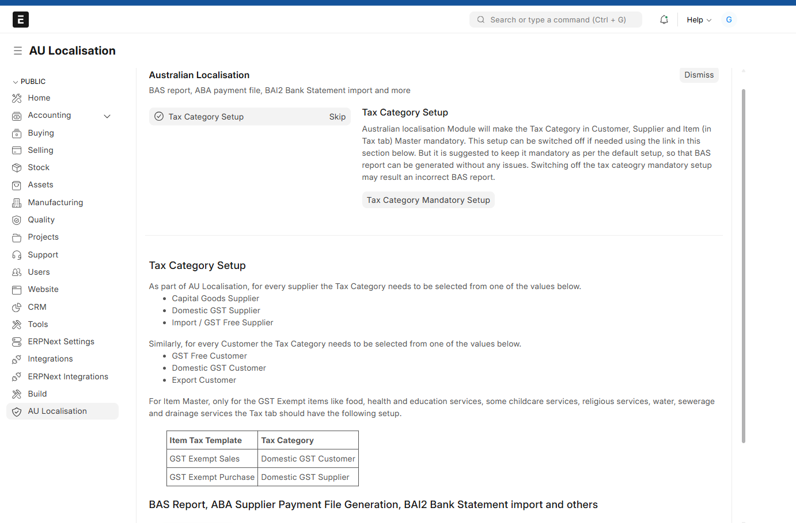

### ERPNext Australian Localisation

Australian Localisation for ERPNext

### Prerequisites
ERPNext v15.x.x (Waiting for Frappe Release on Australian Chart of Accouts)

### Installation

You can install this app using the [bench](https://github.com/frappe/bench) CLI:

```bash
cd $PATH_TO_YOUR_BENCH
bench get-app https://github.com/Arus-Info/ERPNext-Australian-Localisation.git --branch main
bench install-app erpnext_australian_localisation
```



### License

This project is licensed under GNU General Public License (v3)